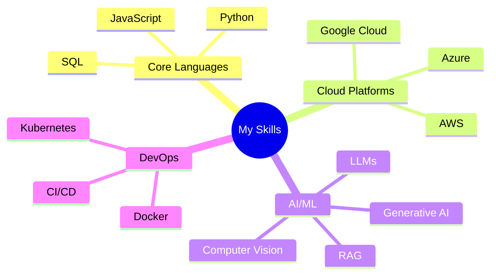

# Hi,I'm Sujit Laware  

  <h3>💡 AI Developer | Multi-Cloud Certified | AI Intern @ Runverve 💡</h3>

  
  
  

##  About Me

  <blockquote>
    <i>Turning ideas into intelligent realities with AI.</i>
  </blockquote>

I'm an AI Intern specializing in end-to-end AI solution development using Amazon Web Services. My expertise spans:

|  | Machine Learning & Deep Learning |
|:--:|:---|
|  | Large Language Models & Generative AI |
|  | AI-Powered Automation & Workflow Optimization |
|  | Cloud-Based AI Solution Deployment (AWS ,GCP & Azure) |
|  | End-to-End AI System Design and Integration |

Currently working at **Runverve**, focusing on large-scale AI implementations and innovations.

##  Tech Stack

### Core Technologies

### Development Tools & Frameworks

### GitHub Stats

      

