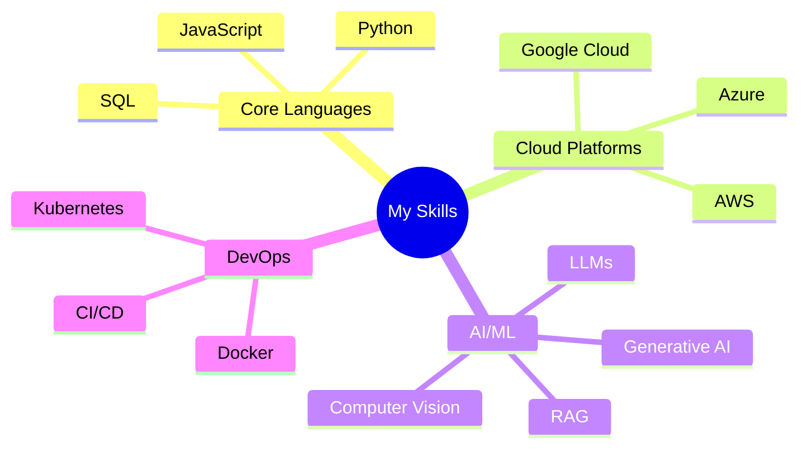

#  Sujit Laware

  <h3>💡 AI Developer | Multi-Cloud Certified | AI Intern @ Runverve 💡</h3>

  
  
  

##  About Me

  <blockquote>
    <i>Turning ideas into intelligent realities with AI.</i>
  </blockquote>

I'm an AI Intern specializing in end-to-end AI solution development using Amazon Web Services. My expertise spans:

|  | Machine Learning & Deep Learning |
|:--:|:---|
|  | Large Language Models & Generative AI |
|  | AI-Powered Automation & Workflow Optimization |
|  | Cloud-Based AI Solution Deployment (AWS ,GCP & Azure) |
|  | End-to-End AI System Design and Integration |

Currently working at **Runverve**, focusing on large-scale AI implementations and innovations.

##  Tech Stack

### Core Technologies

### Development Tools & Frameworks

##  Featured Projects & Resources

<table>
  <tr>
    <td align="center"></td>
    <td><b>Project Portfolio:</b></td>
    <td><a href="https://jovian.ai/yash-kavaiya">View on Jovian</a></td>
  </tr>
  <tr>
    <td align="center"></td>
    <td><b>Technical Writing:</b></td>
    <td><a href="https://medium.com/@yash.kavaiya3">Medium Blog</a></td>
  </tr>
  <tr>
    <td align="center"></td>
    <td><b>GenAI Community:</b></td>
    <td><a href="https://discord.gg/cvHXS4b5">Join Discord</a></td>
  </tr>
  <tr>
    <td align="center"></td>
    <td><b>AI Learning Resources:</b></td>
    <td><a href="https://linktr.ee/yashkavaiya">Linktree</a></td>
  </tr>
</table>

### 🌟 Highlighted Repositories

| Repository | Description |
|------------|-------------|
| [GenAI-Learning](https://github.com/Yash-Kavaiya/GenAI-Learning) | Curated collection of GenAI learning resources and courses |
| [GenAI-Projects](https://github.com/Yash-Kavaiya/GenAI-Projects) | Practical generative AI project implementations |
| [CampusX-courses](https://github.com/Yash-Kavaiya/CampusX-courses) | Free courses and tutorials for AI learning |

##  GitHub Statistics

  

##  Support My Work

  

##  Connect With Me

  
  
  

---

  <i>"Building AI solutions that bridge technology and business value"</i>

